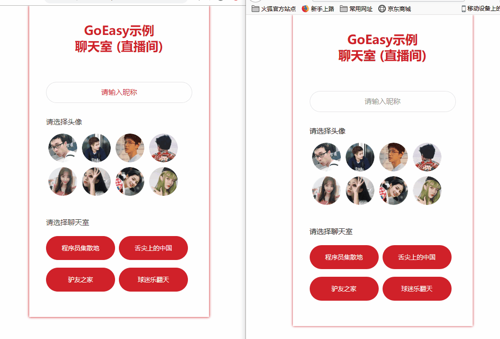
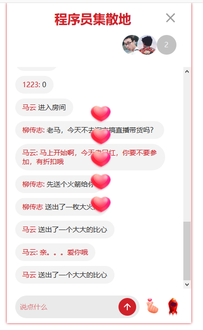

Websocket直播间聊天室教程 - GoEasy快速实现聊天室
=

GoEasy官网: www.goeasy.io    扫码添加GoEasy技术为好友  


本教程和全套源码已经开源在OSChina码云上，会持续更新，最新版本请访问[https://gitee.com/goeasy-io/GoEasyDemo-Live-Chatroom.git](https://gitee.com/goeasy-io/GoEasyDemo-Live-Chatroom.git)

最近两年直播那个火啊，真的是无法形容！经常有朋友问起，我想实现一个直播间聊天或者我想开发一个聊天室, 要如何开始呢？



今天小编就手把手的教你用GoEasy做一个聊天室，当然也可以用于直播间内的互动。全套源码已经开源，git地址：https://gitee.com/goeasy-io/GoEasyDemo-Live-Chatroom.git  

本教程主要目的是为大家介绍实现思路，为了确保本教程能帮助到是不用不同前段技术的朋友，采用了HTML + JQuery的方式，后续还会推出Uniapp(nue/nvue)和小程序版本，大家可以持续关注。

我们这次要实现的聊天室，有两个界面，分别是：
- 登录界面
- 聊天室界面
# 登录


**对于登录界面，我们期望：**
- 用户可以输入自己的昵称
- 用户可以选择自己喜欢的头像
- 用户可以选择进入不同的聊天室（直播间）

**实现步骤**

登录界面的实现，不用多说，因为真的是So Easy! 一个简单的界面，只包含三个简单的逻辑：
- 验证是否输入昵称
- 验证是否选择一个头像
- 根据选择进入相应的聊天室

下边重点讲一下聊天室的实现。

# 聊天室（直播间）


当我们进入一个聊天室后，我们期望：
- 用户能看到当前有多少用户在线，这个数字能够实时的更新
- 用户能看到当前在线用户们的头像，而且能够实时的更新
- 如果有用户进入或离开聊天室     
  a. 聊天室会有“XXX进来了"或"XXX离开了"的提示    
  b. 在线用户的数字和用户的头像列表会随之自动更新
- 用户可以在聊天里发言
- 用户可以发送道具：火箭或者比心

### 实现步骤
#### 第一步：聊天室界面显示
**1. 初始化：**

当用户选择了一个聊天室，显示聊天室界面之前，我们首先要进行以下初始化工作：
- 初始化当前用户currentUser，用户id，昵称，头像
- 初始化当前聊天室ID: currentRoomId
- 初始化GoEasy对象，注意一定要加上userId参数（可以是该用户的uuid或id等唯一标识，只有设置了userId的客户端在上下线时，才会触发上下线提醒）。同时需要将头像和昵称放入userData，当我们收到一个用户上线提醒的时候，我们需要知道这个用户的头像和昵称。
- 初始化onlineUsers，onlineUsers是用来存放当前聊天室在线用户数和在线用户列表。 将当前聊天室Id (currentRoomId)作为channel,执行goEasy.hereNow查询此刻聊天室在线用户数和用户列表，赋值给onlineUsers。除了在进入聊天室的时候初始化onlineUsers，当有用户进入或离开时，也会动态的更新onlineUsers。
- 以当前聊天室的id(currentRoomId)作为channel，执行subscriber方法监听和接收聊天室新消息。
- 以当前聊天室的id(currentRoomId)作为channel，执行subscriberPresence监听用户进入和离开事件。
 
**参考代码：service.js**

```
//初始化聊天室
this.joinRoom = function(userId,nickName, avatar, roomID) {
        //初始化当前用户
        this.currentUser = new User(userId, nickName, avatar);
        //初始化当前聊天室id
        this.currentRoomId = roomID;
        //初始化goeasy，建立长连接
        this.goeasy = new GoEasy({
            host: "hangzhou.goeasy.io",
            appkey: "您的appkey",
            userId: this.currentUser.id,
            userData: '{"nickname":"' + this.currentUser.nickname + '","avatar":"' + this.currentUser.avatar + '"}',
            onConnected: function () {
                console.log( "GoEasy connect successfully.")
            },
            onDisconnected: function () {
                console.log("GoEasy disconnected.")
            }
        });
        //查询当前在线用户列表，初始化onlineUsers对象
        this.initialOnlineUsers();
        //监听用户上下线提醒，实时更新onlineUsers对象
        this.subscriberPresence();
        //监听和接收新消息
        this.subscriberNewMessage();
};
```

**2. 页面展示：**

完成初始化之后，就跳转到直播间界面，在页面上显示以下数据：
- 当前聊天室的名称
- 聊天记录，并且显示聊天室界面
- 展示聊天室界面

**参考代码：controller.js**

```
//页面切换到聊天室界面
function showChatRoom() {
    //更新房间名
    $("#chatRoom-header").find(".current-chatRoom-name").text(loginCommand.roomName);

    //加载聊天历史
    var chatHistory = service.loadChatHistory();
    chatHistory.forEach(function (item) {
        //展示发送的消息
        var otherPerson = createCurrentChatRoomPerson(item.senderNickname + ":", item.content)
        $(".chatRoom-content-box").append($(otherPerson));
    });

    //隐藏登录界面
    $(".chat-login-box").hide();
    // //显示聊天界面
    $(".chatRoom-box").show();
    // //滑动到最后一行
    scrollBottom();
}
```
至此，我们已经完成了goeasy长连接的初始化，和一个聊天室静态展示。接下来，我们一起来看看如何让这个聊天室能够动起来。

#### 第二步：聊天室互动

**1. 实时更新在线用户数和头像列表**

之前在service.initialOnlineUsers方法已经初始化onlineUsers对象，但聊天室随时都有用户进进出出，所以我们接下来还需要能够在有用户上线或下线的时候能够实时的更新onlineUsers，并且实时显示在页面上。
当我们收到一个用户上线提醒，我们将新上线的用户的信息存入在线用户对象onlineUsers里，当有用户离开时，在本地在线用户列表里删除。

**参考代码：service.js**

```
//监听用户上下线时间，维护onlineUsers对象
this.subscriberPresence = function() {
    var self = this;
    this.goeasy.subscribePresence({
        channel: this.currentRoomId,
        onPresence: function(presenceEvents) {
            presenceEvents.events.forEach(function(event) {
                var userId = event.userId;
                var count = presenceEvents.clientAmount;
                //更新onlineUsers在线用户数
                self.onlineUsers.count = count;
                //如果有用户进入聊天室
                if (event.action == "join" || event.action == "online") {
                    var userData = JSON.parse(event.userData);
                    var nickName = userData.nickname;
                    var avatar = userData.avatar;
                    var user = new User(userId, nickName, avatar);
                    //将新用户加入onlineUsers列表
                    self.onlineUsers.users.push(user);
                    //触发界面的更新
                    self.onJoinRoom(user.nickname, user.avatar);
                } else {
                    for (var i = 0; i < self.onlineUsers.users.length; i++) {
                        var leavingUser = self.onlineUsers.users[i];
                        if (leavingUser.id == userId) {
                            var nickName = leavingUser.nickname;
                            var avatar = leavingUser.avatar;
                            //将离开的用户从onlineUsers中删掉
                            self.onlineUsers.users.splice(i, 1);
                            //触发界面的更新
                            self.onLeaveRoom(nickName, avatar);
                        }
                    }
                }
            });
        },
        onSuccess : function () {
            console.log("监听成功")
        },
        onFailed : function () {
            console.log("监听失败")
        }
    });
};
```

**2. 发送消息**

- 初始化一个chatMessage对象，包含发送方id，昵称，消息内容，消息类型为chat
- 将chatMessage转换为一个Json格式的字符串
- 调用GoEasy的Publish方法，完成消息的发送

**参考代码（service.js)**

```
this.sendMessage = function(content) {
    var message = new ChatMessage(this.currentUser.id,this.currentUser.nickname, MessageType.CHAT, content);
    var self = this;
    this.goeasy.publish({
        channel: self.currentRoomId,
        message: JSON.stringify(message),
        onSuccess: function() {
            console.log("消息发布成功。");
        },
        onFailed: function(error) {
            console.log("消息发送失败，错误编码：" + error.code + " 错误信息：" + error.content);
        }
    });
};
```

**3. 接收和显示新消息/道具**

之前我们已经在初始化页面的时候执行了service.subscriberNewMessage()，当我们收到一条消息时：
- 根据消息类型判断是一条聊天消息，还是一个道具
- 如果收到的是一条聊天消息，直接显示到界面
- 如果是道具，就播放动画

**参考代码（service.js）**

```
//监听消息或道具
this.subscriberNewMessage = function() {
    var self = this;
    this.goeasy.subscribe({
        channel: this.currentRoomId, //替换为您自己的channel
        onMessage: function(message) {
            var chatMessage = JSON.parse(message.content);
            //todo:事实上不推荐在前端收到时保存, 一个用户开多个窗口，会导致重复保存, 建议所有消息都是都在发送时在服务器端保存，这里只是为了演示
            self.restapi.saveChatMessage(self.currentRoomId, chatMessage);
            //如果收到的是一个消息，就显示为消息
            if (chatMessage.type == MessageType.CHAT) {
                var selfSent = chatMessage.senderUserId == self.currentUser.id;
                var content = JSON.parse(message.content);
                self.onNewMessage(chatMessage.senderNickname, content, selfSent);
            }
            //如果收到的是一个道具，就播放道具动画
            if (chatMessage.type == MessageType.PROP) {
                if (chatMessage.content == Prop.ROCKET) {
                    self.onNewRocket(chatMessage.senderNickname);
                }
                if (chatMessage.content == Prop.HEART) {
                    self.onNewHeart(chatMessage.senderNickname);
                }
            }
        }
    });
};
```
**4. 发送和接收并展示道具**

其实和发送消息的实现几乎是一样的，具体代码请参考service.js的sendProp方法，controller.js的onNewHeart()方法。动画的播放，使用了TweenMax这个库，主要是为了展示一个实现思路，小编也不知道这个库是否有很好的兼容性，以及是否能够用在Uniapp和小程序下，知道的朋友可以留言分享给大家。

```
this.sendProp = function(prop) {
    var self = this;
    var message = new ChatMessage(this.currentUser.id,this.currentUser.nickname, MessageType.PROP, prop);
    this.goeasy.publish({
        channel: self.currentRoomId,
        message: JSON.stringify(message),
        onSuccess: function() {
            console.log("道具发布成功。");
        },
        onFailed: function(error) {
            console.log("道具发送失败，错误编码：" + error.code + " 错误信息：" + error.content);
        }
    });
};
```


至此，一个聊天室就搞定了，是不是很简单？

如果阅读本文或开发中有任何问题，也欢迎在GoEasy官网添加GoEasy为好友，来获得更多技术支持。